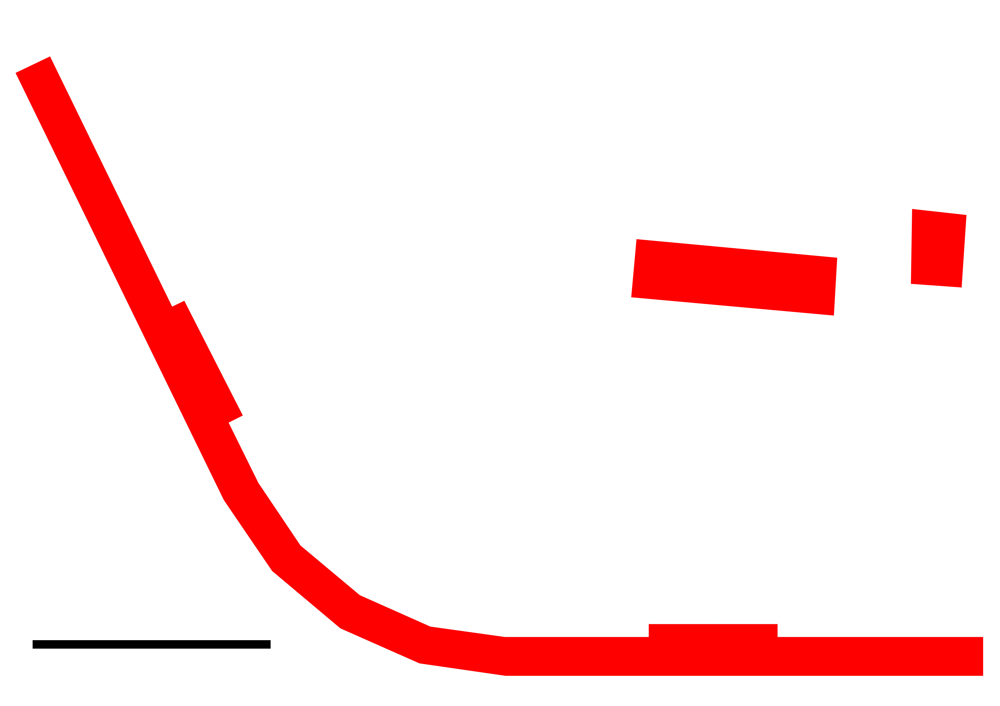

<!-- README.md is generated from README.Rmd. Please edit that file -->

```{r, include = FALSE}
library(tmap)
knitr::opts_chunk$set(
  collapse = TRUE,
  comment = "#>",
  echo = FALSE
)

# parameters from joju
panel_width = 991
panel_height = 1650
panel_area = panel_width * panel_height / 1e6
output = 270
48060 / output 
```

# Introduction

Sustainability is one of Chaco's core values.
With ample south-facing roofspace it makes sense to put up solar panels.
It's much more economical to install PV at build time rather than retrofitting panels, so it makes sense to plan a PV installation into Chaco's design at the earliest possible stage.

The south-facing roof-space available to Chaco is illustrated below:

```{r}
knitr::include_graphics("sitemap-aerial.png")
```


# How much PV is possible?

Based on architectural drawings, the south facing roofspace available was estimated.
The first stage was to digitise the pdfs into simple block representations of the buildings and highlight south-facing roofs, as illustrated in the figure below. 

```{r}
# 
```

This was georectified and digitised in QGIS, resulting in the following data, which has been made available as open data:

```{r, message=FALSE}
solars = sf::read_sf("solars.geojson")
buildings = sf::read_sf("chaco-buildings.geojson")
shading = rbind(
  sf::read_sf("shaded-east.geojson"),
  sf::read_sf("shaded-west.geojson")
)
tm_shape(buildings) +
  tm_fill("grey") +
  tm_shape(solars) +
  tm_polygons(col = "red") +
  tm_shape(shading) +
  tm_polygons(col = "black", alpha = 0.5) +
  tm_scale_bar(breaks = c(0, 0.01)) +
  tm_compass(position = c("left", "top"))
  # tm_view(basemaps = leaflet::providers$OpenStreetMap.BlackAndWhite) +
    
```

The total maximum area available, for the terrace, common house, the shed (the least certain of the roofs for panels) and the total roof area, respectively, was calculated as follows:

```{r}
round({total_south_area = sf::st_area(solars)})
sum({total_south_area = sf::st_area(solars)})
```

Of course, these values cannot be achieved in practice: the entire 390 m^2^ of space available on the terrace roof, for example, cannot be entirely overtaken by panels! 

The initial spec document^[
M&E performance specification(revA)
]
included provision for 127 1600x980mm panels as follow:

- 14 * 6 panel installations on the 14 unshaded roofs of the terrace
- 4 * 4 panel installations on the remaining 4 'type C' terrace roofs that will receive some shading 
- 27 panels on the common house

Assuming a per panel output of 270 W, this would mean Chaco could generate 34 KWp in full sunshine.

```{r, eval=FALSE}
# old panels
(n_panels_original = 14 * 6 +
  4 * 4 +
  27)
n_panels_original * output / 1000
(panel_adjusted_width = panel_width * cos(35 / 180))
(panel_adjusted_height = panel_height * cos(35 / 180))
(panel_adjusted_height = panel_height * cos(35 / 180)) * 2
```

Based on the knowledge that the panels will be slightly larger: 1650x991mm.
Given that the roof has an elevation of 35 degrees, such panels would have a horizontal footprint of 1619x991mm.
In the original scenario, they would cover `r round(1619 * 991 * 127 / 1e6)` m^2^, less than half of the total available space under optimistic assumptions.

The assumption about panel size, plus use of digitising tools in QGIS, allows the panel location to envisioned.
The figure below shows two ways of aligning the panels: stacked as portrait or landscape.
The portrait way is a squeeze: the roof is just over 3.3 m long in the horizontal access; two panels stacked in portrait formation are just over 3.2 m, leaving ~10 cm clearance, which may be insufficient.

```{r}
knitr::include_graphics("closeup3.png")
```

The portrait stacking style leaves more room, at 

```{r}
# joju scenario
n_panels_joju = 178
```


