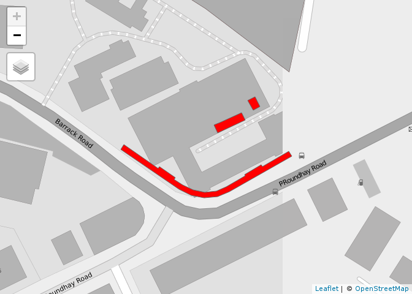

<!-- README.md is generated from README.Rmd. Please edit that file -->
chacoSolar
==========

<!-- badges: start -->
<!-- badges: end -->
Based on architectural drawings, the south facing roofspace available was estimated. The first stage was to digitise the pdfs into simple block representations of the buildings and highlight south-facing roofs, as illustrated in the figure below.

This was georectified and digitised in QGIS, resulting in the following data:

The total maximum area available, for the terrace, common house and the entire shed roof area, respectively, was calculated as follows:

    #> Units: [m^2]
    #> [1] 389.50328  87.03578  30.65030
