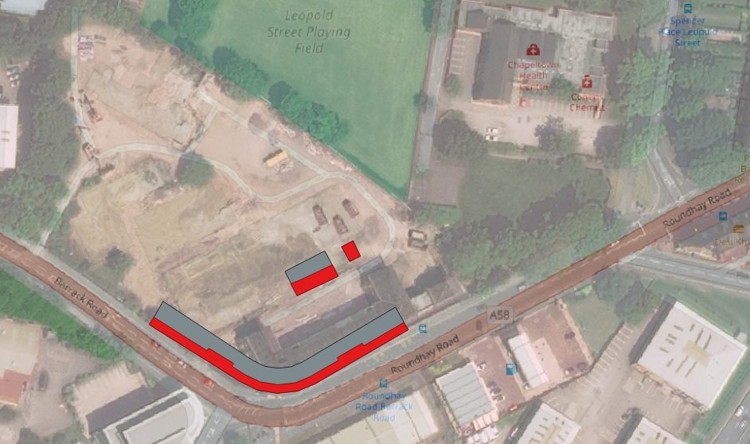
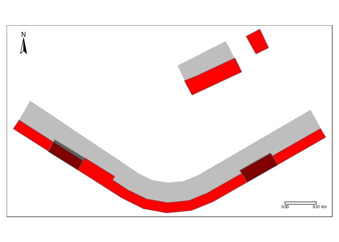
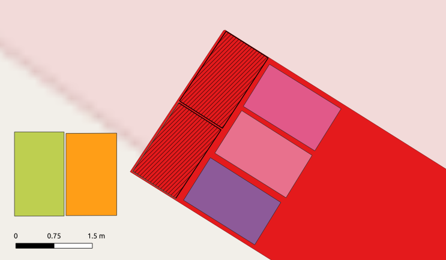
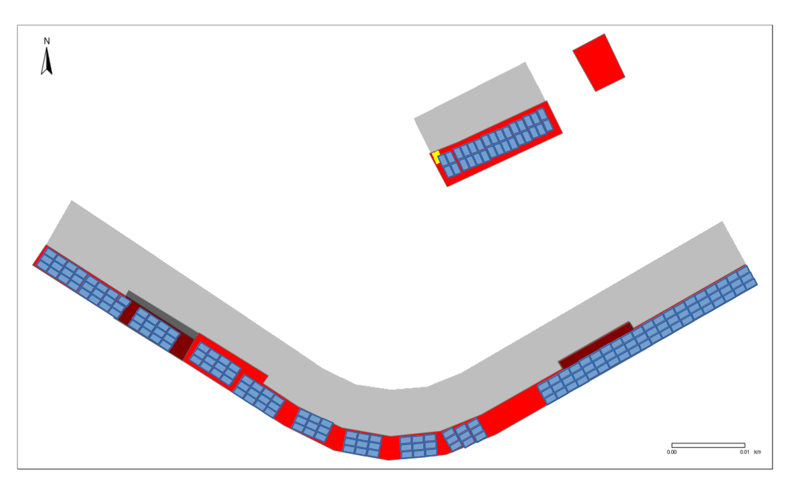
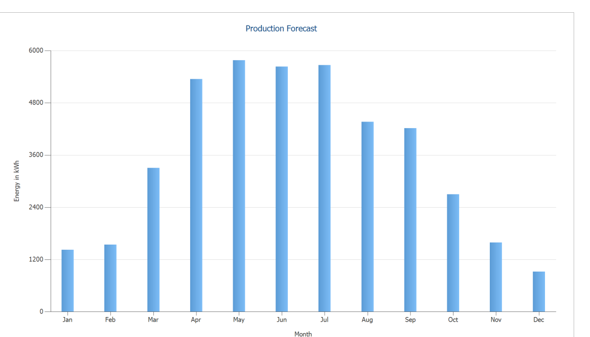

Chaco PV overview document
================

<!-- README.md is generated from README.Rmd. Please edit that file -->
Introduction
============

Sustainability is one of Chaco's core values. With ample south-facing roof-space it makes sense to put up solar panels. It's much more economical to install PV at build time rather than retrofitting panels, so it makes sense to plan a PV installation into Chaco's design at the earliest possible stage.

The south-facing roof-space available to Chaco is illustrated below:

How many panels can fit?
========================

Based on architectural drawings, the south facing roof-space available was estimated. The first stage was to digitise the pdfs into simple block representations of the buildings and highlight south-facing roofs, as illustrated in the figure below.

This was georectified and digitised in QGIS, resulting in the following data, which has been made available as open data, and can be view in an interactive map [here](http://rpubs.com/RobinLovelace/497201):

The total maximum area available, for the terrace, common house, the shed (the least certain of the roofs for panels) and the total roof area, respectively, was calculated as follows:

    #> Units: [m^2]
    #> [1] 390  87  31
    #> 507.1894 [m^2]

Of course, these values cannot be achieved in practice: the entire 390 m2 of space available on the terrace roof, for example, cannot be entirely overtaken by panels!

The initial spec document[1] included provision for 127 1600x980mm panels as follow:

-   14 \* 6 panel installations on the 14 un-shaded roofs of the terrace
-   4 \* 4 panel installations on the remaining 4 'type C' terrace roofs that will receive some shading
-   27 panels on the common house

Assuming a per panel output of 270 W, this would mean Chaco could generate 34 KWp in full sunshine.

Subsequent analysis\[2\], based on the outdated assumption of symmetrical terrace roof side profiles, suggested there may be room for 178 panels:

-   74 panels on the East wing of the terrace, with 2 stacked in portrait orientation per unit of roof width (this stacking alignment is not possible, as shown in the sketch below)
-   74 panels on the West wing of the terrace
-   30 panels on the common house roof (this is the number assumed in the sketch below)

We assume the panels will be 1650x991mm (Manni et al. 2017). Given that the roof has an elevation of 35 degrees, such panels would have a horizontal footprint of 1619x991mm. In the original scenario, they would cover 204 m2, less than half of the total available space under optimistic assumptions.

The assumption about panel size, plus use of digitising tools in QGIS, allows the panel location to envisioned. The figure below shows two ways of aligning the panels: stacked as portrait or landscape. The portrait way is a squeeze: the roof is just over 3.3 m long in the horizontal access; two panels stacked in portrait formation are just over 3.2 m, leaving only a few cm clearance, which may be insufficient.

Portrait and landscape stacking. The two panels on the bottom left show the impact of the panels being at 35 degrees in each alignment: relatively minor.

The landscape stacking style leaves more room all round and 3 panels every ~2m.

The straight sections of the east and west wings are 41 m, leaving room for 24 sets of three on each, 120 panels in total. The south facing roofs on the curve are around 6.7 m at the smallest point, suggesting that there is enough room for 9 panels each (36 in total, as there are 4 curved roof sections). These calculations suggest there is enough room for 156 panels on the terrace, not accounting for the complicating factors of shaded panels (see the darker red areas in the figure above) or the slightly larger roof space on 4 of the houses.

The south facing roof on the common house is ~17.5 m long and just over 5 m wide. It may be possible to fit three panels in portrait formation on the common house roof, allowing 3 \* 16 = 48 panels on the common house roof. However, 30 panels in 2 by 15 formation would leave more room, and we will assume this number (30 panels) will be installed on the common house roof henceforth.

As a sanity check, a rough sketch representing this many panels on Chaco is provided below.

Note that in the sketch the panels are packed tightly from the bottom to the top of the roof across the terrace. The 60 East wing panels are also packed tightly in the along the width of the roof. This is not realistic, especially in the shaded section. The West wing shows panels arranged in groups of 12. This is also not realistic. PV installers should design better, and much more accurate panel layout plans.

**Overall, simplistic calculations based on optimistic assumptions about stacking and shading suggest that Chaco could have room for 186 panels (50 KWp assuming no shading of 270 W modules).**

Sensitivity analysis
--------------------

The analysis presented in the previous section ignores many things. The number of panels that will fit is sensitive to complicating factors around the interfaces between roofs of different heights in the terrace; the assumption that panels can be packed tight on the terrace house roof; and that panels go on the curved roof. So far it ignores the shed, which could fit around 12 (4x3) extra panels, and could be a place to extend the PV capacity of Chaco in the future, perhaps linked to EV charging. But larger changes may include the distance needed between panels and whether or not to put any panels on the curved roof space (4 x 3 panel widths) or shaded sections (~4 x 2 panel widths), which could remove 60 panels, reducing the installed capacity by a around third (to 34 kWp under the first scenario).

If only 2 panels could fit per unit of horizontal roof-space, this would also substantially reduce the installed capacity by the installed number of panel in the east-west dimension (52 in the sketch) to 134 panels (35 kWp, assuming panels go on the curved and shaded roof sections).

Other considerations not covered here may increase or decrease Chaco's the capacity of PV that installed in Chaco; this document is not definitive. It could form a basis of more accurate and well-informed assessments of Chaco's solar PV potential and an optimal design for a PV installation. **An installer with experience of designing and implementing community scale PV installations is recommended to iterate on these designs based on accurate CAD representations of Chaco's roof space.**

Scenarios of installed capacity
-------------------------------

To summarise the above discussion, different scenarios of installed number of panels are:

    #> [1] 186
    #> [1] 162
    #> [1] 150
    #> [1] 126
    #> [1] 134
    #> [1] 118
    #> [1] 110
    #> [1] 94

-   S1: **186 panels**. This involves 3-deep landscape stacking on the terrace, panels on the curved sections, panels in the shaded areas.
-   S2: **162 panels**. This involves 3-deep landscape stacking on the terrace, panels on the curved sections, but no panels in the shaded areas, meaning 2x4x3 (24) fewer panels
-   S3: **150 panels**. This involves 3-deep landscape stacking on the terrace, no panels on the curved sections meaning 3x4x3 (36) fewer panels, panel in the shaded areas
-   S4: **126 panels**. This involves 3-deep landscape stacking on the terrace, no panels on the curved sections meaning 3x4x3 (36) fewer panels, no panels in the shaded areas, meaning 2x4x3 (24) fewer panels
-   S5: **134 panels**. This involves 2-deep landscape stacking on the terrace, panels on the curved sections, panels in the shaded areas
-   S6: **118 panels**. This involves 2-deep landscape stacking on the terrace, panels on the curved sections, no panels in the shaded areas
-   S7: **110 panels**. This involves 2-deep landscape stacking on the terrace, no panels on the curved sections, panels in the shaded areas
-   S8: **94 panels** (25 kWp under panel output assumptions). This involves 2-deep landscape stacking on the terrace, no panels on the curved sections, no panels in the shaded areas

Energy generation
=================

Having high installed capacity, measured in kWp, does not gurarntee high energy generation. Based on local weather conditions, the system can be expected to generate 884 kWh/kWp.[2] This would result in an output of around 44,000 kWh/yr under scenario 1. Monthly generation would be expected to show a strong seasonal pattern, approximating the energy generation per month shown in the figure below.

**The PV system plan should include forecasts of monthly generation, allowing post-installation performance evaluation.**

Other considerations
====================

In addition to the surface area available and the number of ~1.6x1m panels that could be installed, explored in the previous section, there are other considerations that could increase or decrease the performance of the panels, some of which are outlined below.

Panel output and degredation
----------------------------

Modules rated at 270 W have been assumed. However, higher rated panels are available, including:

-   Canadian Solar CS6K-275M: 275 W
-   Hanwha Q-Cells Q.Plus BFR-G4.1: 280 W Hanwha Q.Peak BLK G4.1: 290 W
-   Panasonic LG320N1K-A5: 320 W (this is a 1686x1016 unit)

In outdoor tests, the performance of each panel was found to degrade at different rates (Stein et al. 2018). **Expected lifespan and performance degredation rates should be included in estimates of energy generation.**

Aggregation of power
--------------------

For economies of scale and electricity purchase, electricity will be supplied by a private wire into a central control board. It makes sense for the PV power to supply this central supply, rather than individual houses.

Inverters
---------

Few large inverters are cheaper and more effective than many small ones for a given power rating. This raises the question: how many inverters should be supplied. One scenario would involve 3 inverters, accounting for the 3 main areas of power generation outlined above:

-   One ~20kW inverter for the west wing
-   One ~20kW inverter for the east wing
-   One ~10kW inverter for the common house

It may also make sense to install separate inverters for curved sections. Inverter configuration will be an important factor in overall performance.

Inverter location must also be decided. Options could include placement in attic space, under the stairs and in dedicated storage units outside the thermal envelope.

Financing
---------

One option explored is to finance the PV installation via Leeds Community Energy (LCE), a community benefit company. This could involve LCE owning the panels and leasing them to Chaco until the investment is paid back.

References
==========

Manni, Mattia, Raffaele Tecce, Gianluca Cavalaglio, Valentina Coccia, Andrea Nicolini, and Alessandro Petrozzi. 2017. “Architectural and Energy Refurbishment of the Headquarter of the University of Teramo.” *Energy Procedia*, ATI 2017 - 72nd Conference of the Italian Thermal Machines Engineering Association, 126 (September): 565–72. doi:[10.1016/j.egypro.2017.08.290](https://doi.org/10.1016/j.egypro.2017.08.290).

Stein, Joshua S., Charles Robinson, Bruce King, Chris Deline, Steve Rummel, and Bill Sekulic. 2018. “PV Lifetime Project: Measuring PV Module PerformanceDegradation: 2018 Indoor Flash TestingResults.” In *2018 IEEE 7th World Conference on Photovoltaic Energy Conversion (WCPEC) (A Joint Conference of 45th IEEE PVSC, 28th PVSEC & 34th EU PVSEC)*, 0771–77. Waikoloa Village, HI: IEEE. doi:[10.1109/PVSC.2018.8547397](https://doi.org/10.1109/PVSC.2018.8547397).

[1] M&E performance specification(revA)

[2] Source: [Analysis](https://www.dropbox.com/s/v66fi3ww2puez7h/ChapelTownHousing%20PVSOL%20v2.pdf?dl=0) by community scale PV specialists Jojo Solar.
