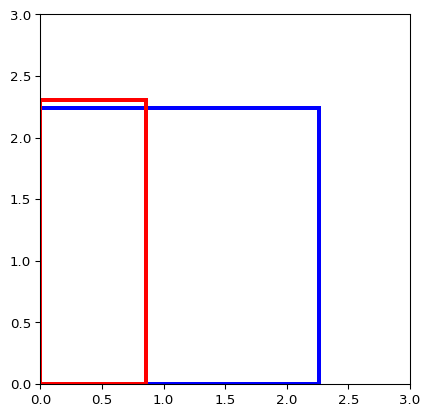

# Off-grid mini PV for community bike share


``` python
# Parameters
# Source: https://poweroak.eu/solar-panels/voltero-s370-370w-36v-solar-panel-with-sunpower-cells
# PV: 2309x860x15mm
pv_width = 0.86
pv_length = 2.309
pv_power_peak = 0.3 # kW
```

STANDARD ESTIMATION METHOD

The approach is as follows:

1)  Establish the electrical rating of the PV array in kilowatts peak
    (kWp)

2)  Determine the postcode region

3)  Determine the array pitch

4)  Determine the array orientation

5)  Look up kWh/kWp (Kk) from the appropriate location specific table

6)  Determine the shading factor of the array (SF) according to any
    objects blocking the horizon

The estimated annual electricity generated (AC) in kWh/year of installed
system shall then be determined using the following formula: Annual AC
output (kWh) = kWp x Kk x SF

Typical values for kk are 900 for Scotland. Let’s assum we have a
shading factor (SF) of 0.5.

Annual Solar Panel Energy Output (in kWh) = kK x system kWp

``` python
kk = 900
sf = 0.5
energy_generated = pv_power_peak * kk * sf
energy_generated 
```

    135.0

Energy used by the ebike can be estimated as 1 full charge per month.
The batter capacity is 0.65 kWh.

``` python
ebike_energy = 0.65 * 12
round(ebike_energy, 1)
```

    7.8

We can calculate the % used as follows:

``` python
# % PV power used by ebike
round(ebike_energy / energy_generated * 100, 1)
```

    5.8

# Dimensions and design

The external dimensions of the gladiator shed are 2072 mm in height,
2260 mm in width, and 2240 mm in depth. The internal dimensions are 1985
mm in height, 2140 mm in width, and 2130 mm in depth.

We can represent this in Python as follows, setting up a visualisation
of the PV panel size relative to the shed:

``` python
import matplotlib.pyplot as plt
import matplotlib.patches as patches
shed_width = 2.26
shed_length = 2.24
# Shed visualisation:
fig, ax = plt.subplots()
ax.add_patch(patches.Rectangle((0, 0), shed_width, shed_length, fill=False, edgecolor='blue', lw=3))
ax.add_patch(patches.Rectangle((0, 0), pv_width, pv_length, fill=False, edgecolor='red', lw=3))
plt.xlim(0, 3)
plt.ylim(0, 3)
plt.gca().set_aspect('equal', adjustable='box')
```


